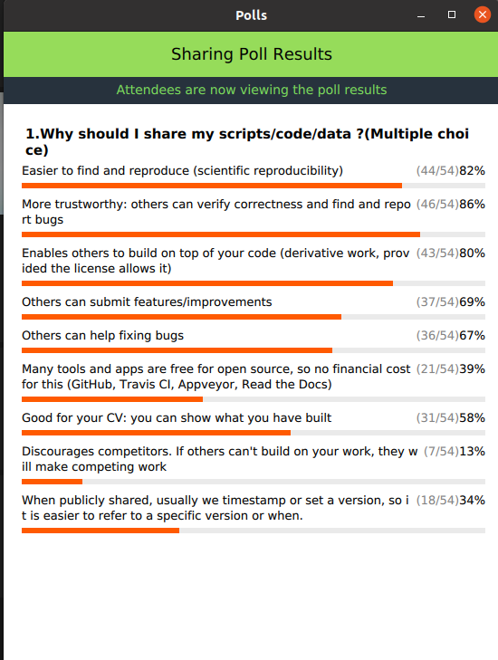
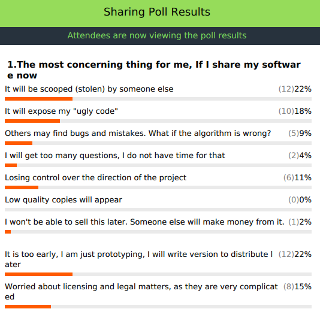
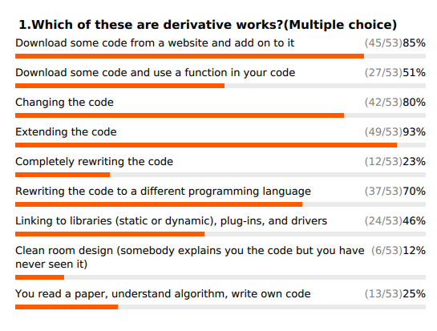

# 2020 November CodeRefinery HackMD, day 4

## Links

- Course page: https://coderefinery.github.io/2020-11-17-online/
- Schedule: https://coderefinery.github.io/2020-11-17-online/#schedule

###### tags: `workshop`


## Icebreaker

What is your favorite programming/scripting language? Do you know any unusual ones?
 - Python, which is the only one I remotely know. I also use R a lot, and do a tiny bit of bash scripting.
 - C++
 - C++ for heavy back-end and Python for interfacing
 - Linux is the one I know the most, Python just a little bit
 - OCaml (<- I always wanted to learn this one) : If you want to learn it, follow this MOOC https://github.com/smeruelo/mooc-ocaml ;-) <-- one of the first programming language I learnt!
    - thanks! +1
 - Python and Rust (<- I want to learn Rust!)
 - Python
 - Python and Matlab
 - Python
 - Python (but I also use R a lot) By the way, if any of the gurus here can suggest Python tutorials for newbies, that could be helpful for students with no programming experience.  In my past life I used C a lot, but I no longer need stuff to go very fast :-)
   - I have started with  https://docs.python.org/3/tutorial/ and can also recommend https://realpython.com/. Later I would have a look at https://docs.python-guide.org/. Great books: "Data Science from Scratch" by Joel Grus (very pragmatic-oriented) and "Effective Python"  by Brett Slatkin (good if you have already written some Python code)).
       - thank you!!
   - I've done a lot of stuff through [Coursera](https://www.coursera.org/).
- Fortran. I am staying away from the punch card fixed format though :-)
  - :-) I also think that Fortran is a really nice language.
- Python primarily, followed by R and a few others. Learned Haskell at some point. Great to learn other ways to approach problems.
- Wolfram (Mathematica)
- C++/CUDA for back-end, Python for front-end
- Julia, wants to offer C-like speed with a more pythonish/matlab-like syntax and logic :+1:
    - Especially powerful for code generation with multiple dispatch.
- Python. TOPAS scripting language for Rietveld refinement.
- This one is quite unusual : http://nik.works/bodyfuck/ - Do you know [Piet](https://esolangs.org/wiki/Piet)? (Haha! no, didn't know that one...)
- Perl
- C,C++,Java, Javascript, PhP, Python, Zig
- C++ and Python
- R is my main language, I use Julia and Python ocassionally
- R, but learning a bit of Python now
- Unusual and nice language: http://shakespearelang.com/
- I mostly use Python, but my favorite language is C++
- Python (often), C/C++ (seldom), 
- Python (most often), C++, Java, Javascript (some times)


## Feedback/suggestions from last week

Few questions arrived after the workshop and we have (hopefully) answered all questions here: https://coderefinery.github.io/2020-11-17-online/hackmd-day3/

Any other questions that you would like to have clarified?

- Do you have any recommendation for a good (like this one!) Python course online? 
    - https://aaltoscicomp.github.io/python-for-scicomp/
    - 
- What about some good Python books? It would be nice if CodeRefinery posted a list of references (links and/or books) for different prgramming languages, if possible.
    - we do have this: https://coderefinery.org/resources/
    - if you know of other good references, don't hesitate to contribute them by raising an issue or send a pull request! (https://github.com/coderefinery/coderefinery.org)
---


## Reproducible research and FAIR data

- Is [mybinder](https://mybinder.org) free to use or are there limitations for the free version? Is there a way to save a session?
  - Yes, it's free. I don't think changes to sessions can be saved. About limitations: https://mybinder.readthedocs.io/en/latest/about/about.html#how-much-memory-am-i-given-when-using-binder (and text nearby)
  - Since it's open, you can also install it on computers you control. Limitations are then what your hardware supports. 

- Do you have any recommendations for how to organize a "project"/"directories" for a phd thesis? Should folders be chatpers?  (Word)
  - Is this a LaTeX project?
      - No- word
         - I don't know Word well and am unsure whether/how it can cross-reference across different files/folders if chapters are in different files/folders.
        - You may find [Pandoc](https://pandoc.org/) useful to merge multiple word documents or to convert from Word to other formats that are more convenient to store in Git.
  - For LaTex I find it useful to have one file per chapter. (Me too.)
      - Would you recommend using LaTex instead of word. My thesis is a data science type- lots of code and analysis.
      - I would recommend something like http://dx.doi.org/10.5281/zenodo.58490 instead. Writing LaTeX is great but has a hard learning curve once you get to customizing the template. The above link allows writing in Markdown and translates to LaTeX behind the scenes.

- Overleaf unfortunately introcuded a 24-hour limit for free accounts for Git tracking.
    - Some universities/groups have a license/plan that allows many collaborators and increased GitHub integration. You may bring this question up to your department.

- where does this structure come from? Is is some kind of agreement, or something that you came up with and want to share?
    - this is a commonly suggested structure for directory structure, you can find it in other resources!

- Overleaf, google docs mainly. There are many good cloud based tools - one concern is where the legal jurisdiction is for the servers. Not a concern in everyday work, but on a more principal level.
  - NextCloud/OwnCloud has an office suite as well.
  - Sounds interesting, will check these out!
- Do you recommend to do releases through GitHub and/or include Working examples of your code as well?
    - making releases of your code is indeed very good, makes it easier to know which version you've used for which results
    - If a version of the software used in a paper, in addition to the release try to get a DOI (will learn later) 


- If I have a python algorithm which imports custom packages/modules, should I have a "requirements.txt" for everything together, or should I have one in the packages folder and one for the main algorithm seperately? Both? (Does that make sense?)
  - You should list all packages that your algorithm depends directly on. You don't have to include dependencies of those packages.

- If you need to have the github version number, will the "requirements.txt" need to be updated each time you make a git commit?
  - Ideally you reference a version (git tag) not a commit. Git tags shouldn't change.

- (In conda) How to pick out which of the packages are really needed? In case the environment includes very many dependencies (e.g. if one forgot to create an environment).
    - you can try to create a minimal new environment and add the packages one by one (while updating requirements.txt) until you're done


- How much documentation do you have during the early and intermediate stages of development?
  - As much as you can afford and dedicate time to. The more the better.
  - You can also try to keep the documentation next to the code (e.g. doctests) to make it easier to maintain and keep in sync with code changes.


### Scary experiences with reproducing research

- Failing to reproduce my own research when a version of one library "corrected a bug". The realization that the research result could be due to a code artifact.
- Was supposed my predecessor's results, ended up not being able to get the exact same curves because some parameters could not be found out 
- [Chemists bitten by Python scripts: How different OSes produced different results during test number-crunching](https://www.theregister.com/2019/10/15/bug_python_scripts/)
- part of the code (pre-existing model) was not allowed by the developers to be shared open-source, while the changes and additions made my me for research were allowed to be shared open-source.
- I had the experience shown in the comic. I received horrible code and was forced to wrk with it, but I was secretly redoing the project properly and then it became the standard. 


### Discussion: How do you collaborate on writing academic papers?

- I mostly used Word, but recently started writing with Overleaf. However, none of my co-authors uses Overleaf/LaTeX. Started trying my hand at RMarkdown, but haven't really gotten proficient with it.
- I use overleaf.
- overleaf +6
- Overleaf as well.
- custom-built, open-source Overleaf clone
- Office 365
- Shared Word docs in MS Teams (like a rubbish version of Overleaf)
- Word document...+2
- Crypto-pad it's like a google docs but you can have your own server
- Send Word-documents back and forth +5 (:scream:) Me too when I cannot convince my collaborators to use Overleaf, so painful.
- org-mode with Git
- Overleaf with most colleagues, sending tex-files back-and-forth with some (:cry:) 
- https://manuscripts.io - similar to Overleaf but without requiring that you know LaTeX (but can import from it). Also includes a reference manager. You can also install it in your organization if privacy is a concern. :eyes:
- No one mentioned Google Docs (:smile_cat:) -  yes we did XD in the conversation
- I write my papers in R using Rmarkdown files. They compile to pdf, word or html thanks to Pandoc integration. I'm the only one in my team coding or using version control. For collaborative writing then I paste the Rmarkdown code in a google doc.
- Overleaf
- Overleaf has a bunch of tutorials available within Overleaf. So, even if you know nothing about LaTeX, Overleaf has basic tutorials for everything.
- The downsides of Overleaf are highly tied to whom you collaborate with and if they know LaTeX.
- Can any of these writing tools be connected to reference managers as Mendeley?
  - Most support the bibtex format which Mendeley can export/import. As far as I'm aware It's a manual integration though.
  - seems to be support for other reference managers too: https://www.overleaf.com/blog/639-tip-of-the-week-overleaf-and-reference-managers
- About overleaf: Does it support commenting and word- (or character-) level "track changes" ?   These were for me the major points that made me give up LaTeX and turn to Word for collaborative paper writing (plus the major hurdle that most people aren't familiar with LaTeX)
    - yes, Overleaf can track changes, check [this link](https://www.overleaf.com/learn/how-to/Track_Changes_in_Overleaf) for some examples.
        - paid version?
            - Unfortunately yes. You may check [here](https://www.overleaf.com/user/subscription/plans) which options are offered for different kind of subscriptions.
            - Maybe your institution pays for these accounts anyways ? (Ours does at least, if yours doesn't maybe you can pitch it - pandemics have a tendency to lead to money being spend on this type of stuff)


###  Exercise/discussion 

https://coderefinery.github.io/reproducible-research/03-dependencies/#exercisediscussion

Compare A, B, C, D

- Is the git links submodules?
    - no they're specific commits of repositories
- I would say it depends on the stage of the project. If you are just sharing with your colleagues or it is already public
- Versions sound nice but sometimes are in conflict. So I end up telling pipenv to skip the lock anyways. But it's good to have them
- In B, the GIT points to master which is not static but might change over time.
- In D, people need to find out themselves that the last two things are only to be found on Github and not e.g. by pip or similar
- I prefer C as it indicates where you may find the source. The version is given too. +1
- [ResearchSoftware Hour, Conda episode](https://researchsoftwarehour.github.io/sessions/rsh-011/)
- Can you explain environments please?
    - I would also advise creating a new environment for any new tool you try. Often when installing tools dependencies get updated with can also cause reproducibility problems.
    - conda, pip and other tools can create isolated software environments (e.g. specific python version, specific versions of libraries, works also for other languages). The environment gets installed in an isolated directory, and you can switch between environments for e.g. different projects
    - crucial problems solved by environment management tools: 1) possibly conflicting dependencies between software packages and libraries, 2) need to use different versions for different projects (e.g. Python2 vs 3)
    - A source of packages. Each channel is managed by a different group of people. You can have a channel for your personal packages too.  
        - Is the last one about channel?
    - For any project using some programming language, the environment consists of the installed/used version of the programming language (compiler / interpreter), libraries and  anything else affecting the result of running the project code. The usual default is the compilers/interpreters and libraries installed withinstalled with


### Exercise 

https://coderefinery.github.io/reproducible-research/03-dependencies/#exercise-creating-and-exporting-conda-environments

- Sorry but some of us have problems... What do we have to do with the requirements.txt?
    - one saves the requirements.txt file in a directory, and then creates an environment from scratch based on the file: `conda create --name wordcount --file requirements.txt --channel bioconda --channel conda-forge` (or with pip: `pip install -r requirements.txt`)
    - But, this last __pip install -r requirements.txt__ command does not install a new environment...
 - CondaFileIOError: 'requirements.txt'. [Errno 2] No such file or directory: 'requirements.txt' +1
 - After 8 minutes, still "Solving environment"... I needed to Ctrl-C the process which was eating 11Gb of RAM
     - yes, resolving dependencies is a mathematically difficult problem and can take time unfortunately. 
     - Did you do this in a new environment? 
       - No. But I think I will never do this mistake again ;-)
     - If it's stuck a solving environment, make sure you don't have additional channels configured in your conda settings. If you did a fresh install of conda, you just need a little patience :)
 - I have been following the instructions: cloned locally from github, then running the commands on git bash, everything seems to proceed fine, but I have no idea what I am doing really. Need some context.
     - the idea is that this is an example project, word-count, that you find online. It comes with a requirements.txt file to help anyone install the required dependencies for the project. One can use conda or pip to install the required dependencies
         - How do I know it worked? Are we supposed to do something in this environment?  By the way my full_env.yml is 334 lines long, does that sound right?
 - The command to install pandas actually installed conda-4.9.2, is that normal?  Nothing about pandas in the output
 - Seems to be stuck at "Solving environment"
     - Mine was stuck for a while as well, but solved as soon as I changed the requirements to snakemake-minimal.
         - Thanks, this solved it!
 - I seriously don't even know where to start... Where do I even click Use this template, in github? Is there a link?
     - https://researchsoftwarehour.github.io/sessions/rsh-011/ may be a good start. 
     - sorry that this was fast. Focus on what's going on now, we will not need to do these steps for the rest of the lesson. We can walk through it together after the workshop today in a BO room if you want


### Break until XX:00


### Recording computational steps 

https://coderefinery.github.io/reproducible-research/04-workflow-management/

We will do this in breakout rooms, and we will be using mybinder.org (cloud service) 

- In the snakemake example picture (first line): we tell the snakemake what files will be used as an input, not created, isn't it? Is there a typo in the picture?
    - do you mean the picture underneath the Snakefile box?
    - We can specify both input and output filenames in the Snakefile, but it's good to use wildcards (e.g. `{output}`) to keep it general
- How would you use snakemake with the SLURM scheduler?
    - some tips here: https://coderefinery.github.io/reproducible-research/04-workflow-management/#optional-snakemake-in-hpc
    - and more tips in the official documentation: https://snakemake.readthedocs.io/en/stable/executing/cluster.html
    - https://hpc-carpentry.github.io/hpc-python/17-cluster/
    - https://www.sichong.site/2020/02/25/snakemake-and-slurm-how-to-manage-workflow-with-resource-constraint-on-hpc/
- Is there a difference between snakemake and the SLURM --array option?
    - SLURM array jobs aren't based on a workflow graph AFAIK, it's just a mechanism to submit multiple jobs in one go so you can't use the nice feature to let the tool figure out which steps to rerun if something changes. 
    - SLURM does support job dependencies though with `--dependency` (see e.g. [here](https://www.hpc2n.umu.se/documentation/batchsystem/job-dependencies)), but again not exactly the same thing


### Exercise, until XX:35

https://coderefinery.github.io/reproducible-research/04-workflow-management/#exercise-using-snakemake

- any command to produce the tree as in https://coderefinery.github.io/reproducible-research/04-workflow-management/#one-problem-solved-in-4-different-ways
    - Here it is:  snakemake -j 1 --dag | dot -Tpng > dag.png
        (you need to install graphviz: conda install -c anaconda graphviz)
        - I meant listing the directories tree ... the first visual not the snamake visual
            - isn't it simply the 'tree' bash command?
- where is 'book' defined? here DATA = glob_wildcards('data/{book}.txt').book
- Is snakemake just for python or does it work for other source code?
    - it's completely general! Snakemake is written in Python, and the syntax of the Snakefile is Python, but you can define rules for running shell scripts, compiled code or any tool

---

- For me, it was always faster to use 1 core compared to 4....
    - This example runs very fast and one does not gain much when using several cores. One can see a larger difference when one uses a larger data set / many books to process.

- Is this something you mostly do at the end? When you already have a good workflow? In early development would this be useful, or just cumbersome?
    - i guess it depends on the project, sometimes might make sense to first prototype the steps of the analysis and later compose a Snakefile. Sometimes Snakefile from the start 

- Is snakemake just for python or does it work for other source code?
    - it's completely general! Snakemake is written in Python, and the syntax of the Snakefile is Python, but you can define rules for running shell scripts, compiled code or any tool

- What is the difference between binder and docker?
    - binder is a cloud service for launching repositories in the cloud. Docker is a virtualization tool with a full operating system packaged into a container. When you open something on mybinder.org, there will actually be a Docker container running under the hood

- [ResearchSoftware Hour, Container for science episode](https://researchsoftwarehour.github.io/sessions/rsh-015/)

- As I understood, you can only get a DOI once you have a release. What if you do another release and want to update in zenodo? You get another DOI?
    - yes you get another DOI whenever you create a new release!
    - Thanks!
- Does a repository need to be public to make a DOI?
    - Yes. By definition a private repository cannot be findable (actually you do not want anyone to see it so you don't want to be findable). but what is recommended is to have public metadata information for which you can get a DOI so it can be findable (to notify that your pricate repo exists). 
    - Ok. thanks
    
### Break until XX:07!

---


## Social coding and open software 

- based on what criteria will it be determined you were the first who release the code?
    - if you publish a git repo online you can see exact times for all commits, so that's one way to show you were first. An additional way is to archive the code in a service like Zenodo, with a DOI (if your competitor does it too, their Zenodo DOI will be higher than yours even if they edit their release date).
        - Except for some super-weird toxic competition cases, it's unlikely that somebody would be so evil that they'd take the effort of modifying the history of commits and changing archivation/release date in some obscure DOI-providing archive instead of Zenodo. To be even more safe: inform about your progress and releases on Twitter and mailing lists, and have external contributors from the community. Also helpful if possible in your scenario: start open and public from "day 1". In summary: Involve the community as early as possible, and the community will know you were the first.
    
- in which cases is it really NOT recommendable to share the code?
    - Intellectual property (IP) restrictions (*i.e.* you're not allowed to do so)
    - Patents
    - If it contains sensitive (wrt privacy) or classified information. Note: in these cases, reasonable code should not contain such information in itself, even if it's made to process such information. Make sure that *e.g.* example and test data are not real sensitive data, and after that you're fine sharing your code



- We had very little time to answer the poll - reading alone took up the time. So of course the earlier choices are picked more ;)
- All of these are great reasons for making your work open. In case of software/scripts, this means  **open source** == **free software**
(*free* as in *freedom*, not necessarily "for free" as so-called *freeware* would be.
Notes: Freeware is *for free* but not necessarily open. The term freeware is much less used these days. The "opposite" case is the so-called *source-available* meaning that source code is available to look at and maybe test privately, without the freedom to distribute it or modify. Neither of these, however, gives the advantages mentioned above in the poll!).



- These are all typical fears. The [course material](https://cicero.xyz/v3/remark/0.14.0/github.com/coderefinery/social-coding/master/talk.md/#7) outlines for most of these, why they usually are unnecessary worries. More details about "fears of open-sourcing" in the scientific context are documented and discussed in [this appendix of the 4OSS article](https://docs.google.com/document/d/1EvhqaDlC1u2iVfqGv-lvPGOgTM5Gc0zRbe70OhaBcqM/edit#heading=h.gewa6vf90ds1) (recommended reading if you're still wondering; it's only 4 pages long).



Are the following cases derivative work? Answers:

* Download some code from a website and add on to it
    * **Yes** 
* Download some code and use a function in your code
    * If you copy the function and paste into your code, then **yes**.
    * If the code is a library/module and you call a function from the library in your code, then it depends on the license of that library/module: If the license of the library/module is a strong ("viral") copyleft (*i.e.* GPL, AGPL), then yes if you distribute the combined work (your code + the library), implicating that you should license the combined work also under GPL/AGPL. Otherwise no.
* Changing the code
    * **Yes**
* Extending the code
    * If extending means taking the code and adding something into it, then **yes**.
    * If extending means *e.g.* creating a subclass of a class defined in a library, then it again depends on whether it's licensed with a strong copyleft (GPL/AGPL), same as in points 2 and 7. 
* Completely rewriting the code
    * If you use the original code or its pieces, then yes. Otherwise see "clean room design" below.
* Rewriting the code to a different programming language
    * **Yes**.
* Linking to libraries (static or dynamic), plug-ins, and drivers
    * Depends on the license of that library/module: If the license of the library/module is a strong ("viral") copyleft (*i.e.* GPL, AGPL), then yes if you distribute the combined work (your code + the library/module), implicating that you should license the combined work also under GPL/AGPL. Otherwise no.
* Clean room design (somebody explains you the code but you have never seen it)
    * **No**. But if the code is explained to you to such detail that you recreate parts of it rather identically, then it may be up for a legal dispute ;). Clean room design is one of the usual ways of creating open-source alternatives to proprietary software (*e.g.* GitLab, LibreOffice), with same or closely similar functionality, but without copyright violation.
* You read a paper, understand algorithm, write own code
    * **No**. (Unless the paper is a patent ;P -- not normally the case for software)


- If someone write/develop codes based on your codes, then the newly written/developed codes are cited, is there good license that specifies that your original codes are also always cited as well? (so it might be long "history" of citing)
    - a proper open-source license mustn't enforce citations, but good manners (science ethics) do. You can include a CITATION file in your repository to make it easier for others to cite the right references. A good format for software citations, in addition to standard BibTex *etc.*, is the [Citation File Format (CFF)](https://citation-file-format.github.io/). 

- often the code is derived from a fixed-term project which may not get funding afterwards. However, the code and derived app are found successful by the community. Many inquires come to improve, extend, etc. How shall this be handled when there are no resouces to maitain the released code/app after the project ends?
    - Hopefully someone will fork it and continue working on it even after the original author(s) can't anymore.
    - Hopefully there will be more opportunities for applying for funding to maintain useful (scientific) software. There are some, but it's very little. The usual way is to apply for funding to build derivative work, which will then cover both maintenance and upgrades to functionality.

- open seems to work in a mutually agreement. But how if things are not and the code/paper is not cited properly because you are just a student? Then another group/professor/collegue more famous uses it (since it is open) and they are the ones to get the more recognition.
    - You can always refer to logs and such that show that the student actually did the work and should have the correct recognition. However, if someone else claims to have done the work, it can be difficult to overcome that. Still, logs/commits/documentation/emails on mailing lists etc. will be an evidence of who did the work. Stand up and claim! ;) In general, involvement with the community (publicity), *e.g.* on GitHub and/or Twitter and/or mailing lists, as early in the project as possible, will make it easier for the student to get recognised.
        - If a serious violation of one's authors rights happens, such as publishing completely without recognising the authorship, adequate measures should be taken (if the job/caree situation of the victim allows it). Universities and journals have contacts for that.
    - If you publish, but the derived work gets cited instead of you, that can only rarely be fixed (unless you are a reviewer or and editor). We should keep hoping for a new academic world where citation counts matter less. One quick remedy option: When writing grants / applying for jobs / advertising your software, mention the derived work and its citation counts!

- A project might have last commit two years ago but people might be actively using it which could be an important consideration before deciding to use the project. How to find out if others are using the same project so it might be safe to start using the same project?

    - GitHub and others show the number of forks and stars of a repository, this can give an idea of how much used a code is
    - Usually though, an actively used package will be actively developed because active usage leads to discovery of bugs and requests for features
    - If it's actively used, there might be at least new issues on GitHub. Unless the software works completely without any issues (it does happen, especially for some simple tools) :D

- How to link github with hackmd or versa? Is there any use case for using both together somehow?
    - you can connect a hackmd to github. Go to "Menu" (three dots) and "Versions and GitHub sync". I think you first need to create a GitHub repo, which you then connect to from hackmd

- A project might be related to ongoing research. When is it safe or a proper time to use git for writing the paper and hosting the code/data to avoid being plagiarised by others until a formal publication?
    - i think this is a difficult question. Many groups prefer private development (still using Git but private repos) until a paper is published, others share code from day 1, and others do something in between
    - General recommendation: Unless you have special reasons for keeping it private for some time, make it public from the beginning. Then you still have 2 options:
        - a) advertise the project publicly to get community contributions (is often a great option!)
        - b) not advertise until you feel ready

- Would you say that number of users/number downloads could also be a good measure to look at when discovering a new package? Does it say anything about the reliability?
    - I do not think it is easy to find number of downloads in all cases. In github you can not (unless you're repository owner). What you could see are forks, stars, and followers. 
    - But you could get indirect numbers like number of open issues/PRs with live discussions
    - under github.com/username/repository/graphs/traffic you can see number of clones and number of visitors
    - via the GitHub API, you can also see the number of downloads of releases
        - API /repos/:owner/:repo/releases/:release_id for getting downloads number of your assets (files attached to the release), field download_count mentioned below, but, as commented, only for the most recent 30 releases..

- Link to the page shown: https://softdev4research.github.io/4OSS-lesson/ (in a shorter form at https://softdev4research.github.io/recommendations/)

- An interesting link to FAIR data, licensing,...: https://fair-software.eu/

- is there any comparative analysis to find the right license for code, project or data?
    - yes, this is useful to start with: https://choosealicense.com/
    - for **data**, the situation is more confused because they may or may not be creative work. [A brief overview in the lecture notes](https://cicero.xyz/v3/remark/0.14.0/github.com/coderefinery/social-coding/master/talk.md/#30). In EU, curated databases / data collections are anyhow protected by a *sui generis* right, so adding an open license is strongly recommended in order to allow reuse and derivative work.

- Slides for this lesson: https://cicero.xyz/v3/remark/0.14.0/github.com/coderefinery/social-coding/master/talk.md/#1

-  How to handle a breach of license from an individual's perspective? For example, the author finds out that  derivative work did not cite or refused to?
    -  Citation mustn't be required by a proper open-source license, although some form of adequate attribution yes (_e.g._ adding a note into the code). It is, however, part of good manners / ethics in academia. Adequate attribution is also required by the Creative Commons Attribution licenses (CC-BY) for non-software work, where citation is indeed the proper form of attribution in academia.
    -  For actual violations of open source licenses, there are community organisations that may help you. And in academic setup, notifying the journal which published the breaching work may be a good option. In any case, first make sure that it really was a violation (the open source / free software organisations may help you in difficult cases). Some organisations: Software in Public Interest, Open Source Initiative, Free Software Foundation (for GNU & co), Open Bioinformatics Foundation (for bioscientific software), ...

- A project can have mulitple components. Do we assign DOI separately for paper, data, and code? Does DOI change when we imporove any one of those?
    - A great and very important question!
    - If it's a small project, and everything is in the same repository, then **common release** (implying **common DOI**) for the whole contents of the repo is the best option. After a publication in a journal or a preprint server, the article ("paper") will get another DOI from the journal/preprint server.
    - If it's a bigger project, you'd probably have multiple software components in separate repos, separate manuscripts, various data sets that you analyse, *etc.* Then releasing these various repos separately (and getting separate DOIs) will be the best option. Keeping in mind good tracking of dependencies with versions (see requirements.txt examples in the reproducibility lesson of CR)
    - In Zenodo, which is the default and probably best choice for GitHub repo releases, you get:
        - One DOI for all you releases, that will always resolve to the latest release
        - One DOI for each release (GitHub release), which will each keep pointing to its release forever
        (this means that with your first release, you get 2 DOIs from Zenodo)

- So what applies in Norwegian Universities ? [regarding IP rights, hackmd editor note]
    - The university basically owns what you do as an employee there (as far as I understand). However, it practice they don’t interfere much.
    - From my experience, this is often not well-defined in Norwegian unis when it comes to software (there may be differences I'm not aware of). In practice, they will probably not try to claim your author's right/copyright. And also are aware that collaborations would not be possible if they claim copyright(!)
    - You will find employees’ right at each univ. ex. Of UiB (https://regler.app.uib.no/regler/Del-2-Forskning-utdanning-og-formidling/2.1-Forskning/2.1.5-Formidling-og-forvaltning-av-forskningsresultater/Reglement-om-haandtering-av-ansattes-rettigheter-til-forsknings-og-arbeidsresultater-ved-Universitetet-i-Bergen/Regulation-on-handling-employees-rights-to-the-results-of-work-and-research-at-the-University-of-Bergen) and UiO (https://www.uio.no/english/for-employees/employment/work-results/rights-to-work-results.html)
    - At least UiOs guideline says “Software with appurtenant documentation and source code that has a potential for commercial exploitation” is covered by the agreement.
        - "potential for commercial exploitation" can surely be disputed
            - in addition, open source / free software doesn't mean that there cannot be a profitable commercial service provided around it. Indeed, more and more businesses work that way, and universities and scientific infrastructures too (including ELIXIR Norway in biosciences, which provides help to researchers which may or may not be free, depending on the size of effort, and price depending on public *vs.* private sector)
        - There are many UiO contributors to open source software and many leaders of open source projects, without UiO standing in the way. But unfortunately, I can imagine that because of such one-sided rules, some scientific project leaders w/o open source experience may try to jeopardise sharing.
    - At UiB it clearly says that the university's IP rules DO NOT prevent authors from publishing open source software.

-  Is there any good material which discusses a comparison among some of the followings:
```
1. Jupyter terminal
2. cmd
3. powershell
4. anaconda powershell prompt
5. anaconda prompt
6. git bash
```
    - A great question! I'm not aware of such, and it will depend on OS, at least. Maybe something CR could provide?
        - On my Windows 10 laptop, I use: Git Bash for everything where I don't need conda (git, ssh, python, bash, ...); Anaconda Prompt if I need conda (or want to test a script whether it works there too); terminal in Jupyter if I do something on a server that runs Jypyter Lab, or if I quickly need to test something while otherwise working in Jupyter Lab; shell commands in a Jupyter Notebook if I need (with "!"); and none of the rest. And I use [Gitpod](https://gitpod.io) when hacking with some C++ toy code.
    - Please others answer more ...


## Feedback for day 4

Please write down one thing you liked and one thing we should improve.


### Good:
 - In all, I really appreciate the half-day format of the workshop. It means I can attend a workshop, while still having time to work on my stuff later in the day.
 - Love step two "...then a miracle happens"
 - very nice that <instructor> also showed the HackMD doc as well and tightly linked it to the presentation.
 - snakemake looks awesome, thanks for sharing!
 - The Code Refinery **resources** [page](https://coderefinery.org/resources/) is a gold mine. Thank you!
     - thanks! Please send PRs or raise issues if you have something to add!
- excellent content on day 4, perhaps a bit more focus on article publications then only code focus though understandble.

### To improve:

 - Too much going on at the same time. Snakemake+binder/Jupyter+conda environments; people who are unfamiliar with all of these are pretty much sure to get lost. I would motivate each independently and have individual exercises before combining. +5 (Seconded this comment!)
     - good point, thanks. We will improve this
 - perhaps explain how it is possible to use a variable before its definiton as happening here: 
`DATA = glob_wildcards('data/{book}.txt').book`
while `book is defined later` in a later rule 
`rule count_words`

- In general, lots of good information but it seems that it is often rushed (estimated times for each section seem to be underestimated). I think extending the course so that we have the full amount of time for each concept would make it easier to absorb the material. (+3)
- I agree that the section about Binder/Snakemake should be 'slowed down', as it takes some time to *digest*. It could easily be a stand-alone section for a half/full day.
- I would have liked some small discussions in the breakout rooms (like 1 occasion during this half day), to make it a bit more active. (But I do understand that this is a bit trickier when doing it online...) +1
- Having different breakout rooms to solve different doubts 
    - Hmm, an interesting idea...

